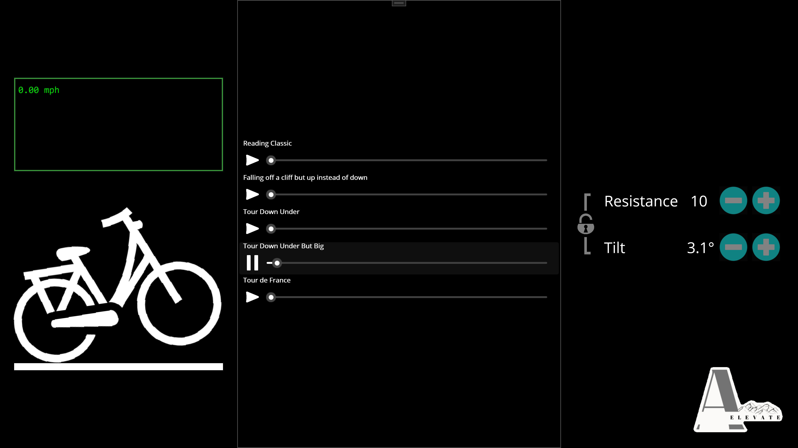

# Aelevate Bike Trainer GUI
This project serves as a GUI for a bike trainer offering variable resistance, simulated changes in incline, and preprogrammed routes for resistance and incline changes. This GUI was written using [.NET MAUI](https://dotnet.microsoft.com/en-us/apps/maui).

